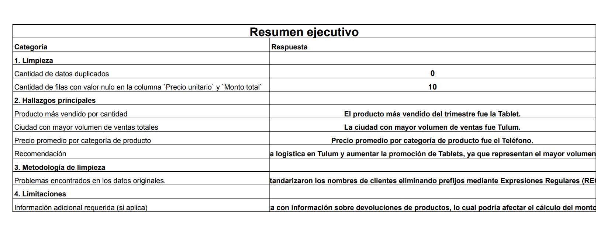

# 🧹 Pipeline de Limpieza y Estructuración de Datos (Excel)

## 🎯 Objetivo del Proyecto
Auditoría, estandarización y limpieza de una base de datos transaccional cruda de ventas de hardware tecnológico. El propósito fue transformar datos inutilizables en un modelo estructurado, dejándolo listo para la extracción de métricas de ingresos y toma de decisiones.

## 🛠️ Herramientas y Metodología (Data Quality)
* **Herramienta:** Excel Avanzado.
* **Procesamiento ETL Básico:** 
  * Manejo y tratamiento de valores nulos (Missing Data).
  * Corrección de formatos de fecha y estandarización de texto (Upper/Lower/Proper).
  * Normalización de variables cuantitativas (Precios unitarios, Cantidades, Montos totales).
  * Validación de integridad en claves primarias (IDs de orden).

## 📈 Estructuración Analítica
Una vez validada la calidad de los datos, se construyeron modelos de **Tablas Dinámicas** para consolidar métricas clave:
1. Rendimiento de ingresos por categoría de producto.
2. Desempeño de ventas segmentado por ciudad.
3. Distribución temporal del volumen de transacciones.

## 👁️ Visualización de Resultados
A continuación, una muestra de la estructuración de los datos. *(El historial completo de auditoría y las tablas dinámicas están disponibles en el archivo `.xlsx` adjunto).*

