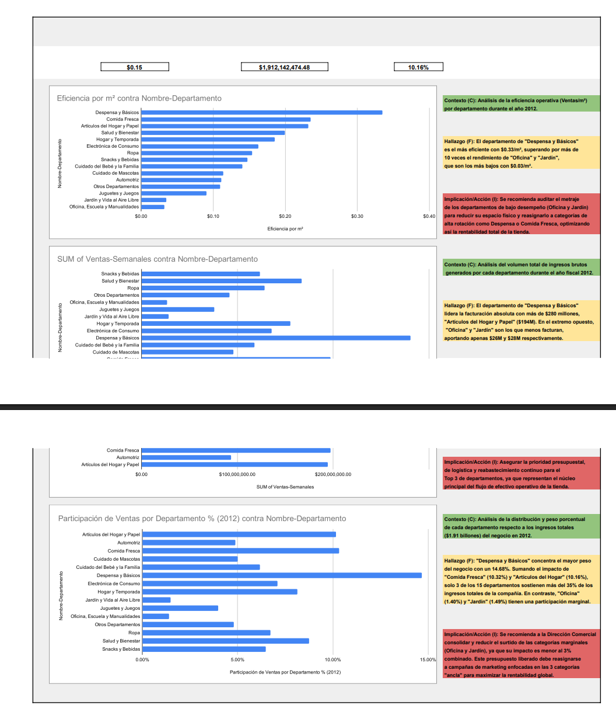

# 📊 Dashboard Ejecutivo y Análisis de Eficiencia Operativa (Walmart)

## 🎯 Objetivo del Negocio
Auditoría integral sobre $1.91 billones de dólares en ventas consolidadas (año fiscal 2012) para la Dirección Comercial. El análisis evalúa el rendimiento operativo y la eficiencia por metro cuadrado ($/m²) entre departamentos para fundamentar la reasignación de metros comerciales, presupuestos y control de inventario.

## 🛠️ Herramientas y Metodología
* **Herramienta:** Excel Avanzado.
* **Procesamiento ETL:** Integración relacional de catálogos de tiendas, departamentos y registros transaccionales semanales.
* **Control de Calidad (QA):** Validación de integridad referencial (filtros de departamentos huérfanos y corrección de ventas negativas).
* **Framework de Comunicación:** Estructuración de insights bajo metodología **C-F-I (Contexto, Hallazgo e Implicación)**.

## 📈 Hallazgos Clave (Insights de Negocio)

1. **Disparidad Crítica en Eficiencia ($/m²):**
   * El departamento de **"Despensa y Básicos" lideró la eficiencia con $0.33/m²**, superando por **más de 10 veces** a las áreas de menor rendimiento ("Oficina" y "Jardín" con solo **$0.03/m²**).
2. **Concentración de Ingresos (Pareto Comercial):**
   * El Top 3 de departamentos (*Despensa y Básicos* 14.68%, *Comida Fresca* 10.32% y *Artículos del Hogar* 10.16%) sostiene más del **35% de los ingresos totales** del negocio ($280M+ en la categoría líder).
3. **Áreas de Suboptimización:**
   * Las categorías de "Oficina" (1.40%) y "Jardín" (1.49%) operan con un impacto marginal conjunto menor al 3%, ocupando metraje costoso con baja rotación.

## 💡 Recomendaciones Estratégicas
* **Reasignación de Metraje:** Auditar y contraer el espacio físico asignado a "Oficina" y "Jardín", transfiriendo esos metros cuadrados a categorías de alta rotación como "Despensa y Básicos" y "Comida Fresca".
* **Priorización Presupuestal:** Blindar la cadena de suministro y capital de trabajo del Top 3 de departamentos para mitigar riesgos de desabasto.

## 👁️ Visualización del Dashboard Ejecutivo

