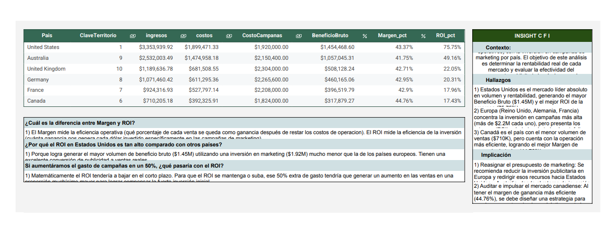

# 💰 Extracción y Modelado de KPIs Financieros con SQL

## 🎯 Objetivo del Negocio
Auditoría y modelado del desempeño financiero global cruzando registros históricos transaccionales (ingresos y costos operativos) con la inversión en campañas de marketing por país. El objetivo central fue evaluar la rentabilidad real de cada mercado y la efectividad del presupuesto publicitario a través de tres métricas clave: **Beneficio Bruto**, **Margen de Ventas** y **Retorno de Inversión en Marketing (ROI)**.

## 🛠️ Herramientas y Metodología
* **Motor de Consultas:** SQL (Agregaciones complejas, uniones relacionales `JOIN`, filtros condicionales y campos calculados).
* **Métricas Modeladas:**
  * **Beneficio Bruto:** $\text{Ingresos} - \text{Costos Operativos}$
  * **Margen (%):** $\frac{\text{Beneficio Bruto}}{\text{Ingresos}}$ (Eficiencia operativa del producto).
  * **ROI (%):** $\frac{\text{Beneficio Bruto}}{\text{Costo de Campañas}}$ (Eficiencia de conversión del gasto publicitario).
* **Framework de Comunicación:** Estructuración de insights bajo metodología **C-F-I (Contexto, Hallazgo e Implicación)**.

## 📈 Hallazgos Clave (Insights de Negocio)

1. **Liderazgo Absoluto de Estados Unidos (Alto ROI):**
   * Estados Unidos es el mercado más rentable del portafolio: generó **$1.45M USD en Beneficio Bruto** con una inversión de marketing de **$1.92M USD**, alcanzando un **ROI líder de 75.75%** y un margen operativo del **43.37%**.
2. **Suboptimización en Mercados Europeos:**
   * Las regiones de Europa (Reino Unido, Alemania y Francia) concentran el mayor gasto publicitario (**más de $2.2M USD cada una**), pero reportan los retornos más bajos del portafolio (**ROI entre 17.96% y 22.05%**), evidenciando rendimientos decrecientes en pauta.
3. **Oportunidad de Escalamiento en Canadá:**
   * Aunque registra el menor volumen de ventas ($710K USD), Canadá opera con la estructura más eficiente del negocio, logrando el **Margen de ganancia más alto (44.76%)**.

## 💡 Recomendaciones Estratégicas
* **Reasignación de Presupuesto:** Reducir la sobreinversión publicitaria en el bloque europeo y transferir capital hacia Estados Unidos y Australia, donde la tasa de conversión y el ROI son significativamente más altos.
* **Escalamiento de Margen en Canadá:** Diseñar una campaña de adquisición focalizada para el mercado canadiense que aproveche su alta eficiencia operativa (44.76%) sin disparar costos fijos.

## 👁️ Visualización de Resultados y KPIs Financieros

