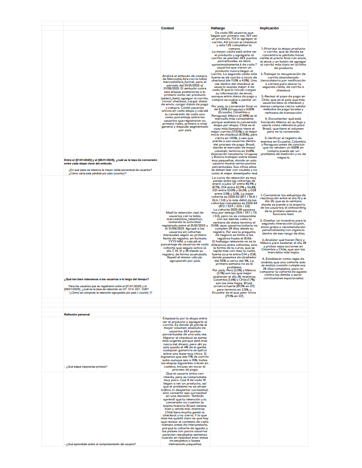

# 📉 Análisis de Embudo de Conversión y Retención de Cohortes (MercadoLibre / SQL)

## 🎯 Objetivo del Negocio
Auditoría del comportamiento del usuario en la plataforma de MercadoLibre (periodo 01/01/2025 al 31/08/2025). El estudio analiza dos dimensiones críticas:
1. **Embudo de Conversión (Funnel):** Identificación de fricciones y puntos de fuga desde la primera visita hasta la confirmación de compra.
2. **Retención de Cohortes (LTV):** Medición de la persistencia de usuarios activos en ventanas de D7, D14, D21 y D28 días post-registro.

## 🛠️ Herramientas y Metodología
* **Motor de Consultas:** SQL Avanzado (`Window Functions`, agregaciones por cohorte, conteo de usuarios únicos `DISTINCT` y normalización porcentual).
* **Framework Analítico:** Estructuración de insights mediante **C-F-I (Contexto, Hallazgo e Implicación)**.
* **Control de Calidad Analítica (QA):** Filtrado de cohortes incompletas (exclusión de agosto para métricas D28) y ponderación de volumen por país para evitar sesgos de muestra pequeña.

## 📈 Hallazgos Clave (Insights de Negocio)

### 1. Dinámica del Embudo de Conversión
* **Tasa Global:** De cada 100 usuarios únicos iniciales, **76.9%** visualizan un producto, **11.0%** lo agregan al carrito, **4.0%** inician checkout y únicamente **1.25%** completan la compra.
* **El Cuello de Botella Principal:** La mayor pérdida ocurre entre la visualización del producto y la adición al carrito (**caída de 65.9 puntos porcentuales**; 6 de cada 7 usuarios abandonan en este paso).
* **Fricción Secundaria:** Se registra una contracción del **63.6%** al pasar de carrito (11.0%) a inicio de checkout (4.0%).
* **Comportamiento por Mercado:**
  * **México (2.48% conv. final):** Mercado con mayor consistencia operativa etapa por etapa.
  * **Chile (1.03% conv. final):** Mayor tracción inicial (17.53% carrito y 8.25% checkout), pero sufre un abandono severo en la pasarela de pago.
  * **Brasil (0.68% conv. final):** Líder en volumen bruto con rezago en eficiencia de cierre.

### 2. Retención por Cohortes Mensuales
* **Curva de Decaimiento:** Se observa estabilidad en las cohortes maduras (Enero–Julio):
  * **D7:** 85.9% – 87.7%
  * **D14:** 53.9% – 56.8%
  * **D21:** 23.0% – 26.6%
  * **D28:** 2.0% – 3.0%
* **Punto de Inflexión:** La retención colapsa críticamente entre el **día 14 y el día 28** (pasando de ~55% a ~3%).
* **Persistencia por País en D28:** **Perú (3.2%)** y **México (3.1%)** presentan la mejor retención a largo plazo frente a Colombia (1.6%) y Chile (1.7%).

## 💡 Recomendaciones Estratégicas
1. **Optimización de Ficha de Producto (PDP):** Priorizar el flujo *Producto $\rightarrow$ Carrito* transparentando costos de envío, disponibilidad de inventario y optimizando la visibilidad del CTA principal.
2. **Automatización de Recuperación de Carrito:** Implementar triggers de reenganche (email/push) entre las 2 y 24 horas posteriores al abandono.
3. **Auditoría de Pasarela en Chile:** Revisar métodos de pago locales y tasas de rechazo bancario para capturar la alta intención de checkout (8.25%).
4. **Ventana de Reactivación:** Desplegar campañas de retención e incentivos de segunda compra entre el **D10 y D20**, antes del punto de caída hacia D28.

## 👁️ Visualización del Informe Ejecutivo

