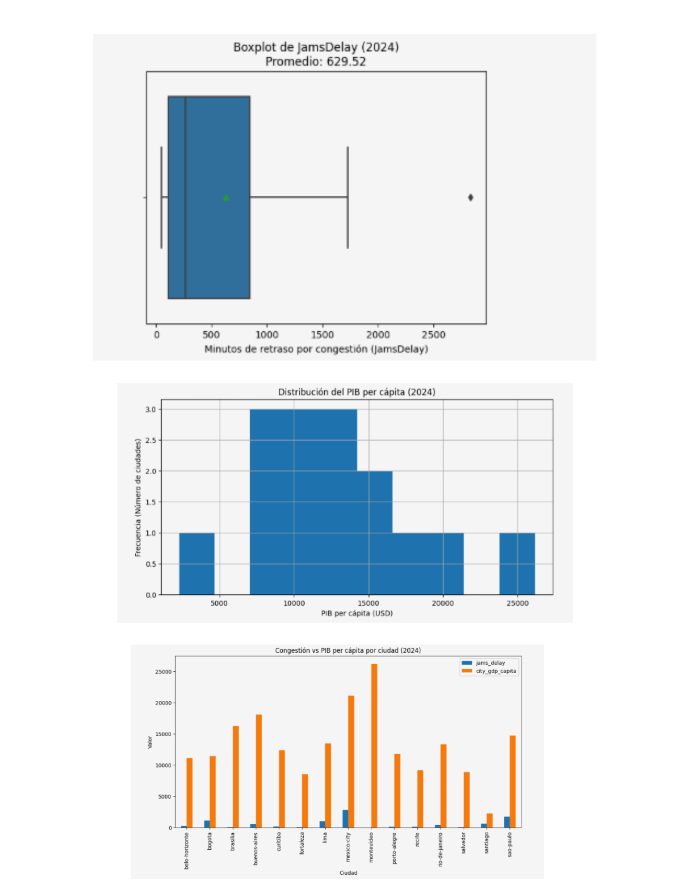

# 🐍 Pipeline ETL y Análisis Exploratorio de Datos (Python)

## 🎯 Objetivo del Negocio
Evaluar la correlación empírica entre la movilidad urbana (congestión vehicular) y la productividad económica (PIB per cápita) en las principales ciudades de Latinoamérica durante 2024. El análisis busca fundamentar decisiones estratégicas para la priorización de inversión en infraestructura de transporte público y privado.

## 🛠️ Herramientas y Metodología (ETL & EDA)
* **Lenguaje y Librerías:** Python (Pandas, NumPy, Seaborn, Matplotlib).
* **Procesamiento ETL:** 
  * Extracción y unificación de dos fuentes de datos dispares (TomTom Traffic Index y OECD Cities).
  * Limpieza de tipos de datos, estandarización de strings (Regex, reemplazo de separadores europeos) y parseo de fechas (Datetime).
  * Agregación de métricas transaccionales a promedios anuales y unión relacional (`INNER JOIN`) por llaves de ciudad y año.
* **Análisis Exploratorio (EDA):** Detección de valores atípicos (outliers) mediante Boxplots y análisis de distribución con histogramas.

## 📈 Hallazgos Clave (Insights de Negocio)

1. **Sesgo Crítico en la Congestión (Outlier):**
   * La región presenta una congestión promedio de 629 minutos anuales, pero la Ciudad de México distorsiona la media al registrar **2,833 minutos de retraso** (más del cuádruple del promedio regional, superando métricas de Tokio o Nueva York).
2. **Descorrelación entre Ingreso y Movilidad:**
   * No existe una relación lineal directa entre la riqueza de una ciudad y su eficiencia de tráfico. Montevideo lidera el PIB per cápita (≈$26,000 USD) operando con congestión casi nula, mientras que Bogotá y Sao Paulo sufren alta congestión con niveles de PIB medio-bajos.
3. **El Factor Estructural:**
   * El análisis sugiere que la fricción en la movilidad responde al diseño demográfico y densidad de la infraestructura urbana, más que al poder adquisitivo per cápita.

## 💡 Recomendaciones Estratégicas
* **Foco de Inversión Primario (Ciudad de México):** Concentrar el capital de desarrollo de infraestructura en CDMX, ya que presenta el déficit de movilidad absoluta más grave de la muestra sin un nivel de productividad que justifique o compense dicha fricción.
* **Auditoría Secundaria (Bogotá y Sao Paulo):** Establecer comités de evaluación para estos dos mercados, los cuales muestran signos de estancamiento en movilidad con ingresos per cápita vulnerables.

## 👁️ Visualización del Análisis Exploratorio (EDA)

