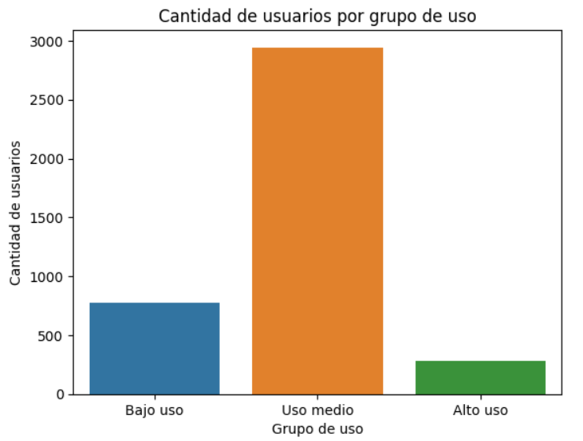
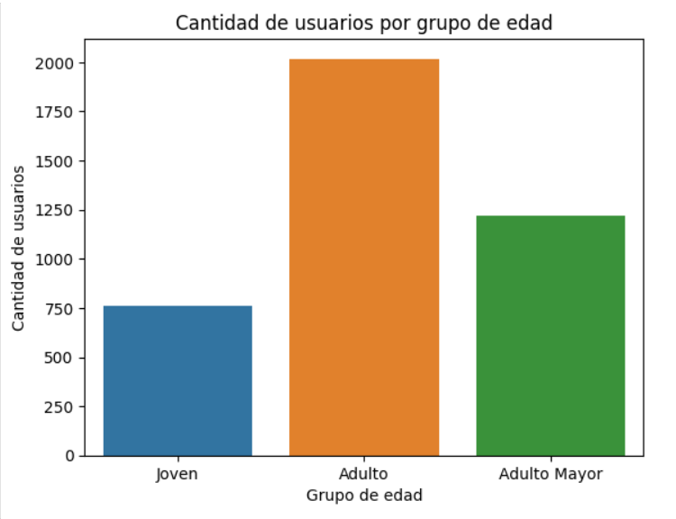

# 📱 Análisis de Comportamiento de Uso y Segmentación de Clientes (Python)

## 🎯 Objetivo del Negocio
Analizar cómo los clientes de **ConnectaTel**, empresa de telecomunicaciones con operaciones en México y Colombia, utilizan realmente sus servicios móviles (llamadas y mensajes). El análisis busca identificar patrones de consumo, detectar comportamientos atípicos y segmentar a la base de clientes por edad y nivel de uso, con el fin de fundamentar decisiones estratégicas para la optimización de la oferta comercial y la retención de usuarios.

## 🛠️ Herramientas y Metodología (Data Cleaning & EDA)
* **Lenguaje y Librerías:** Python (Pandas, NumPy, Seaborn, Matplotlib) en Jupyter Notebook.
* **Integración de Datos:**
  * Unificación de tres fuentes de información: catálogo de planes, base de 4,000 clientes y 40,000 registros de uso.
  * Agregación de eventos transaccionales a métricas por cliente (mensajes, llamadas y minutos) y unión relacional (`LEFT JOIN`) por `user_id`.
* **Calidad y Limpieza de Datos:**
  * Detección y corrección de valores sentinel (`-999` en edad y `"?"` en ciudad).
  * Conversión de fechas (Datetime) e identificación de registros imposibles fuera del rango de captura.
  * Validación de valores faltantes MAR (Missing At Random) según el tipo de evento.
* **Análisis Exploratorio (EDA):** Análisis de distribución con histogramas por plan, detección de outliers mediante Boxplots y método IQR, y segmentación de clientes basada en reglas.

## 📈 Hallazgos Clave (Insights de Negocio)

1. **Problemas Críticos de Calidad en la Captura:**
   * El **14.1%** de los clientes carecía de una ciudad válida (469 nulos y 96 registros con `"?"`), y **40 registros** presentaban fecha de alta en 2026, un año imposible para datos capturados hasta 2024.
2. **Perfil Dominante del Cliente:**
   * La base está concentrada en clientes de **uso medio (≈74%)**, del grupo **Adulto de 30 a 59 años (≈50%)** y en el **plan Básico (64.88%)**.
3. **Preferencia por la Mensajería:**
   * Los mensajes representan el **55.2%** de toda la actividad registrada, superando a las llamadas (**44.8%**).
4. **Segmento de Usuarios Intensivos (Outliers):**
   * Las variables de consumo presentan sesgo a la derecha: un **7%** de clientes de **alto uso** consume muy por encima del promedio. Se conservaron en el análisis por tratarse de clientes reales y del segmento de mayor valor comercial.
5. **Fuga de Clientes:**
   * El **11.65%** de la base (466 clientes) ya registra churn, lo que representa un riesgo directo de ingresos.

## 💡 Recomendaciones Estratégicas
* **Upselling a Premium (Alto Uso):** Dirigir ofertas de migración de plan al segmento de alto consumo, el de mayor valor y potencial de ingreso por cliente.
* **Foco Comercial Primario (Adulto de Uso Medio):** Concentrar las campañas principales en el segmento más grande de la base para maximizar el alcance.
* **Paquete de Mensajería:** Diseñar una oferta centrada en mensajes, el servicio con mayor demanda.
* **Estrategia de Retención (Bajo Uso):** Crear un plan económico para el 19% de clientes de bajo consumo, reduciendo el riesgo de churn por percepción de sobrecosto.
* **Gobierno de Datos:** Implementar validaciones de edad, ciudad y fecha en el alta de clientes para eliminar sentinels y registros imposibles.

## 👁️ Visualización de la Segmentación de Clientes

